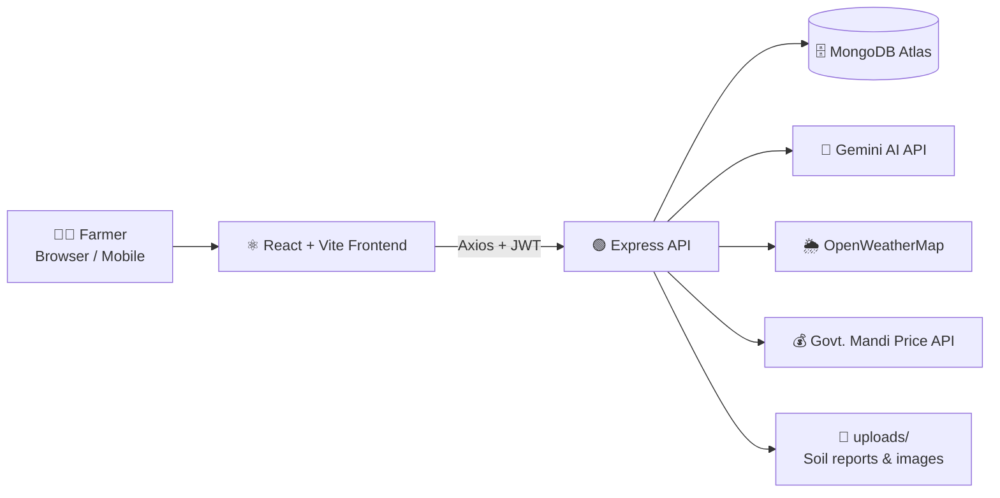
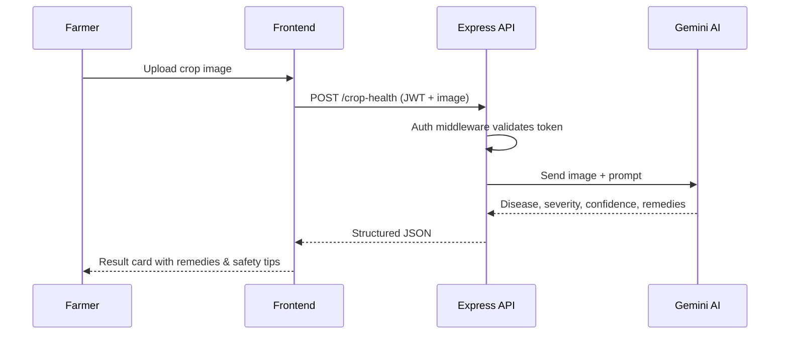

<div align="center">

# 🌾 Farmer Crop Advisory App

### Empowering farmers with smart, data-driven crop decisions

[](https://farmer-bl1m.onrender.com/)


**[🚀 Live Demo](https://farmer-bl1m.onrender.com/)** · **[✨ Features](#-features)** · **[⚙️ Setup](#️-getting-started)** · **[📡 API](#-api-overview)** · **[🤝 Contributing](#-contributing)**

</div>

---

## 📖 Table of Contents

- [Overview](#-overview)
- [Problem & Solution](#-problem--solution)
- [Features](#-features)
- [Tech Stack](#-tech-stack)
- [System Architecture](#-system-architecture)
- [Project Structure](#-project-structure)
- [Getting Started](#️-getting-started)
- [Environment Variables](#-environment-variables)
- [API Overview](#-api-overview)
- [Multi-language Support](#-multi-language-support)
- [Security](#-security)
- [Deployment](#-deployment)
- [Roadmap](#-roadmap)
- [Contributing](#-contributing)
- [License](#-license)
- [Author](#-author)

---

## 🚀 Overview

The **Farmer Crop Advisory App** is an AI-powered platform that helps farmers make informed decisions about **crop selection, soil health, disease management, market prices, and government schemes**. It combines real-time data (weather, mandi prices), generative AI (Google Gemini) and an intuitive dashboard to help farmers maximize yield and profitability.

## 🎯 Problem & Solution

| Problem | How the app helps |
|---|---|
| Farmers pick crops by tradition, not data | Recommendations based on soil type, market trend and risk preference |
| Late or wrong disease diagnosis | Upload a photo, get disease, severity, confidence and remedies from Gemini AI |
| Poor soil management | Soil report analyzer with fertilizer and organic improvement suggestions |
| No access to fair prices | Live mandi prices by location |
| Language barrier | AI chatbot that understands and replies in the user's language |
| Scattered scheme information | One place for government schemes with official links |

---

## ✨ Features

### 🏠 Smart Farm Dashboard
- Overview of farming activities, crop health and AI insights
- Tracks **Sowing · Fertilizing · Pesticide · Harvest · Uploads**
- Crop table with name, fertilizer, pest, dates and a status badge
- Full CRUD: **Add ➕ · Edit 🖊 · Delete ❌ · View 🔍**

### 🌱 Crop Recommendation
- **Inputs:** soil type (auto-filled from profile), market and risk preference
- **Outputs:** top recommended crops, soil suitability %, expected yield, market trend, ideal sowing window

### 🧪 Soil Health: Smart Analyzer
- Upload a soil report (**PDF / CSV**) or enter **N, P, K, pH, organic matter** manually
- Fertilizer and organic improvement suggestions
- "Improve Soil" checklist of actionable steps

### 🤖 Crop Health: AI Disease Detection (Gemini)
- Upload or capture crop images
- Detects **disease, severity and confidence %**
- Suggests **remedies, dosage and safety tips**

### 📚 Crop Farming Guide
- **100+ crops** covered
- Sowing time · land preparation · irrigation · pest management · harvest
- Search any crop and get a detailed guide instantly

### 💰 Market Price (Real-Time)
- Auto location detection
- Live mandi prices (retail and wholesale)
- Powered by Government APIs

### 🌦 Weather Forecast
- 5-day forecast: rain %, temperature, humidity, wind, sunrise/sunset
- Powered by OpenWeatherMap API

### 🏛 Government Schemes
- Scheme information with direct links to official websites
- Clean card UI with **Visit Website** buttons

### 🗣 Community Feedback
- Farmers can post, edit, delete and reply to feedback
- Only the post owner can modify their own content

### 💬 AI Chatbot (Gemini)
- Ask farming questions in **any language**
- Chat UI with attachments and automatic language detection

### 👨‍🌾 User Profile
- Name, email, location, soil type
- Edit profile, password management, secure logout

---

## 🧠 Tech Stack

| Layer | Technologies |
|---|---|
| **Frontend** | React.js (TypeScript), Vite, Tailwind CSS, Axios, Lucide Icons |
| **Backend** | Node.js, Express.js |
| **AI** | Google Gemini AI API |
| **Database** | MongoDB Atlas (Mongoose) |
| **Authentication** | JWT-based secure login / signup |
| **External APIs** | OpenWeatherMap, Government Mandi Price API |
| **Hosting** | Render |

---

## 🏗 System Architecture



**Request flow (example: disease detection)**



---

## 📂 Project Structure

```
farmer-crop-advisory/
├── backend/
│   ├── config/
│   │   └── mongodb.js              # MongoDB Atlas connection
│   ├── controller/
│   │   ├── crophealthcontroller.js # Gemini disease detection
│   │   ├── marketController.js     # Mandi prices
│   │   ├── questioncontroller.js   # AI chatbot
│   │   ├── soilreportcontroller.js # Soil report analysis
│   │   ├── translationController.js# Language translation
│   │   └── usercontroller.js       # Auth & profile
│   ├── locates/
│   │   ├── en/                     # English translations
│   │   └── hi/                     # Hindi translations
│   ├── middleware/
│   │   └── auth.js                 # JWT verification
│   ├── model/
│   │   └── usermodel.js
│   ├── routes/
│   │   ├── croproute.js
│   │   ├── marketRoute.js
│   │   ├── questionroutes.js
│   │   ├── soilRoute.js
│   │   ├── translationroutes.js
│   │   └── userroute.js
│   ├── uploads/                    # Uploaded images / reports
│   ├── utils/
│   ├── server.js                   # App entry point
│   └── package.json
│
├── frontend/
│   ├── public/
│   ├── src/
│   │   ├── assets/                 # assets.ts, crops.ts, seeds.ts
│   │   ├── components/             # Navbar, Sidebar, Header, Footer, Layout, ScrolPages
│   │   ├── context/
│   │   │   └── appcontext.tsx      # Global state
│   │   ├── pages/
│   │   │   ├── home.tsx
│   │   │   ├── Login.tsx
│   │   │   ├── DashBoard.tsx
│   │   │   ├── CropRecommendation.tsx
│   │   │   ├── Soilhealth.tsx
│   │   │   ├── Crophealth.tsx
│   │   │   ├── CropFarmingGuide.tsx
│   │   │   ├── MarketPrice.tsx
│   │   │   ├── WeatherForecast.tsx
│   │   │   ├── GovernmentSchem.tsx
│   │   │   ├── Formingmaterials.tsx
│   │   │   ├── Askquestion.tsx
│   │   │   └── Profile.tsx
│   │   ├── App.tsx
│   │   └── main.tsx
│   ├── tailwind.config.js
│   ├── vite.config.ts
│   └── package.json
│
└── README.md
```

---

## ⚙️ Getting Started

### Prerequisites

- **Node.js** v18 or higher
- **npm** (or yarn / pnpm)
- A **MongoDB Atlas** cluster (or local MongoDB)
- API keys for **Gemini**, **OpenWeatherMap** and the **Government Mandi Price API**

### 1. Clone the repository

```bash
git clone https://github.com/<your-username>/<your-repo>.git
cd <your-repo>
```

### 2. Set up the backend

```bash
cd backend
npm install
cp .env.example .env      # then fill in your keys
npm run dev               # or: npm start
```

### 3. Set up the frontend

```bash
cd ../frontend
npm install
cp .env.example .env      # then fill in your values
npm run dev
```

### 4. Open the app

| Service | URL |
|---|---|
| Frontend | http://localhost:5173 |
| Backend | http://localhost:5000 (or the `PORT` you set) |

---

## 🔐 Environment Variables

> ⚠️ Never commit your `.env` files. Rename the variables below to match what your code actually reads.

**`backend/.env`**

```env
PORT=5000
NODE_ENV=development

# Database
MONGODB_URI=mongodb+srv://<user>:<password>@<cluster>.mongodb.net/farmer

# Auth
JWT_SECRET=your_super_secret_key
JWT_EXPIRES_IN=7d

# AI
GEMINI_API_KEY=your_gemini_api_key

# External APIs
OPENWEATHER_API_KEY=your_openweathermap_key
MANDI_API_KEY=your_data_gov_in_key

# CORS
CLIENT_URL=http://localhost:5173
```

**`frontend/.env`**

```env
VITE_API_URL=http://localhost:5000
VITE_OPENWEATHER_API_KEY=your_openweathermap_key
```

---

## 📡 API Overview

Route groups follow the files in `backend/routes`. Adjust paths to match your `server.js` mounts.

| Module | Route file | Purpose | Auth |
|---|---|---|---|
| User | `userroute.js` | Signup, login, profile, password change | Mixed |
| Crop | `croproute.js` | Crop CRUD, recommendation, AI disease detection | 🔒 |
| Soil | `soilRoute.js` | Soil report upload and analysis | 🔒 |
| Market | `marketRoute.js` | Live mandi prices by location | 🔒 |
| Questions | `questionroutes.js` | AI chatbot and community feedback | 🔒 |
| Translation | `translationroutes.js` | Multi-language content | Public |

**Authentication header**

```http
Authorization: Bearer <your_jwt_token>
```

**Example: login**

```http
POST /api/user/login
Content-Type: application/json

{
  "email": "farmer@example.com",
  "password": "********"
}
```

```json
{
  "success": true,
  "token": "eyJhbGciOiJIUzI1NiIs...",
  "user": { "name": "Ramesh", "location": "Deoria", "soilType": "Alluvial" }
}
```

---

## 🌐 Multi-language Support

- Translation files live in `backend/locates/` (`en`, `hi`)
- The chatbot auto-detects the user's language and replies in the same language
- To add a language, create a new folder (for example `locates/bn/`), copy the English keys and translate the values

---

## 🛡 Security

- 🔐 Password hashing (bcrypt)
- 🪪 JWT-based authentication with a protecting middleware (`auth.js`)
- 👤 Ownership checks so only post owners can edit or delete their feedback
- 📁 Validate file type and size for uploaded images, PDFs and CSVs
- 🔑 Secrets stored only in environment variables
- 🌍 CORS restricted to the trusted client origin

---

## ☁️ Deployment

| Part | Platform | Notes |
|---|---|---|
| Backend | Render (Web Service) | Build: `npm install` · Start: `npm start` |
| Frontend | Render Static Site / Vercel | Build: `npm run build` · Publish dir: `dist` |
| Database | MongoDB Atlas | Allow Render's IPs in Network Access |

> 💡 Render free instances sleep when idle, so the first request may take a few seconds.

---

## 🗺 Roadmap

- [ ] 📱 Mobile app (React Native)
- [ ] 🔔 Weather and price alerts (SMS / push)
- [ ] 🗣 Voice input for the chatbot
- [ ] 🌐 More regional languages
- [ ] 🛰 Satellite and NDVI-based crop monitoring
- [ ] 📶 Offline mode (PWA)
- [ ] 📈 Price forecasting with ML
- [ ] 🧑‍🤝‍🧑 Farmer-to-buyer marketplace

---

## 🤝 Contributing

Contributions are welcome!

1. Fork the repository
2. Create a feature branch: `git checkout -b feature/amazing-feature`
3. Commit your changes: `git commit -m "feat: add amazing feature"`
4. Push to the branch: `git push origin feature/amazing-feature`
5. Open a Pull Request

---

## 📄 License

Distributed under the **MIT License**. See `LICENSE` for details.

---

## 👤 Author

**Your Name**
- GitHub: [Github](https://github.com/Tausif289)
- LinkedIn: [Linkdin]((https://lnkd.in/p/gWY5-tUh))

---

<div align="center">

### 🌾 Built with ❤️ for farmers

⭐ If you found this project useful, please give it a star!

</div>
